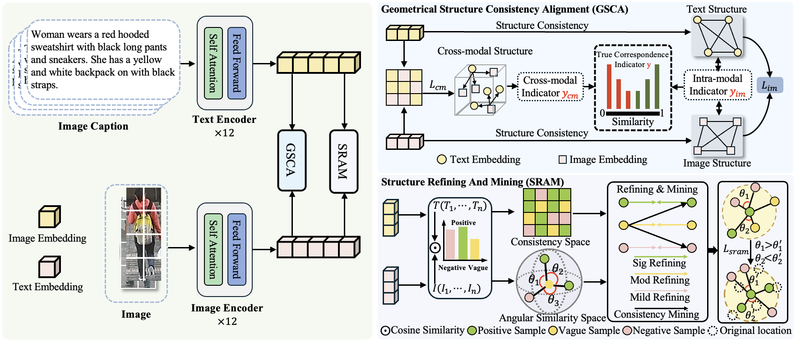
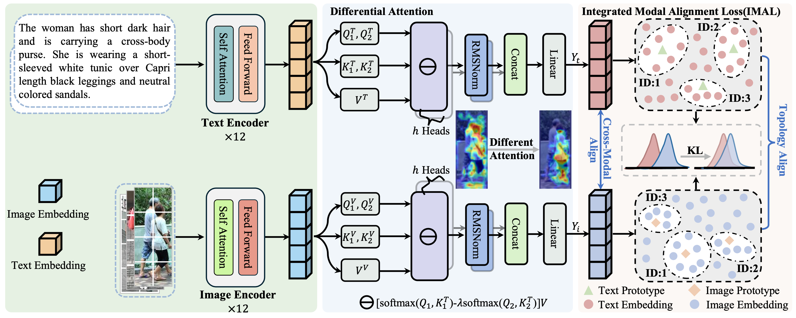

#### 📄 已发表学术论文
- Xinpan Yuan†, **Shaomin Xie†**, Liujie Hua*, Chengyuan Zhang*, Guihu Zhao, Lin Yuanbo Wu*. Geometry-Aware Noisy Correspondence Mitigation for Cross-Modal Text-Based Person Retrieval. AAAI Conference on Artificial Intelligence 2026. **(CCF-A, Oral (4.6%), 学生导师共一)**

**Abstract:** Text-Based Person Retrieval (TBPR) aims to accurately retrieve target individuals from large-scale image databases using only textual descriptions. Existing methods typically assume a ground-truth correspondence between text and images (i.e., strongly correlated). However, in real-world scenarios, this assumption may not be able to hold for the cross-modal matching due to weak or even corrupted correlations between textual descriptions and visual content, referred to as noisy correspondence (NC). Such NC largely disrupts the correspondence learning between visual and semantic modalities. Though prior works have improved single-modal robustness against noisy labels, systematic modeling of both cross-modal and intra-modal geometric structures in TBPR remains limited attention. In this paper, we propose Geometric Structure Consistency Alignment (GSCA) to TBPR, which leverages cross-modal cosine similarity and intra-modal nearest-neighbor affinity to learn visual-semantic consistency under noisy correspondence. To mitigate the structural corruption caused by noisy pairs, we introduce the Structure Refinement and Mining (SRAM) module. By partitioning training data into clean, ambiguous, and noisy subsets, SRAM enables the model to strategically refine the cross-modal correspondence by mining reliable pairs, thus enhancing the reliability of positive or negative samples discrimination and preserving structural consistency across modalities. Extensive experiments demonstrate that our method achieves state-of-the-art performance across three public datasets. On CUHK-PEDES, it boosts Rank-1 by 1.42\% in noise-free conditions, sustaining a robust 74.25\% Rank-1 under a 50\% noise ratio.

**Overall Framework**

- Xinpan Yuan, **Shaomin Xie**, Liujie Hua*, Wenguang Gan, Jiawei He. CCMA: Consistency-Aware Cross-Modal Alignment Text-based Person Retrieval. International Conference on Acoustics, Speech, and Signal Processing 2026. **(CCF-B, 导师一作, 学生二作)**

**Abstract:** Text-based person retrieval (TBPR) aims to retrieve target images from large-scale datasets using textual descriptions. However, the image modality often contains more complex information, such as background redundancy and multi-target interference, leading to \textit{Cross-modal Misalignment Bias (CMB)} during alignment. In addition, most existing methods assume a one-to-one mapping between images and texts, neglecting the common overlap of textual descriptions and causing \textit{Intra-modal Semantic Overlap (ISO)}. To address these issues, we propose a \textbf{CCMA} framework. Specifically, we design a \textbf{Differential Attention} mechanism that explicitly suppresses irrelevant or noisy features and focuses on semantically relevant regions, thereby enhancing local discriminability and cross-modal consistency to alleviate CMB. Moreover, we propose an \textbf{Integrated Modal Alignment Loss (IMAL)}, which regularizes intra-modal neighborhood structures to enhance feature compactness and semantic consistency, thereby alleviating ISO. Extensive experiments on three public datasets validate our method, achieving state-of-the-art results with gains of 0.91\% Rank-1, 0.42\% mAP, and 0.54\% mINP on CUHK-PEDES.

- Xinpan Yuan, **Shaomin Xie**, Guihu Zhao*, Liujie Hua*. CLIO: A Unified Framework for Consistency-Aware Learning and Intra-Modal Optimization in Text-Based Person Re-identification. IEEE International Conference on Intelligent Computing 2025. **(CCF-C, Oral, 导师一作, 学生二作)**

**Abstract:** Text-based person retrieval aims to accurately locate a target individual from a large-scale image gallery based solely on a given textual description. Existing methods heavily rely on high-quality cross-modal annotations. However, in real-world scenarios, annotations are typically sourced from either manual labeling or large-scale language models, both of which inevi-tably introduce noise. Such noise can lead to semantic confusion between weakly aligned positive pairs and visually similar negative pairs. To ad-dress this challenge, we present a novel framework CLIO which employs consistency refining and mining and intra-modal optimization to address noisy correspondences in data annotation. We first introduce a Consistency Refinement and Mining (CRAM) module, which models intra-modal feature consistency across augmented views to estimate the reliability of each sam-ple and distinguish between true and noisy correspondences. Additionally, to alleviate modality-specific representation degradation, we design a Cross-modal and Uni-modal Implicit Label Alignment (CUIA) module, which propagates confidence-aware labels across modality-specific and shared embedding spaces to enhance cross-modal alignment. Extensive ex-periments demonstrate that CLIO consistently achieves superior perfor-mance under noisy correspondence conditions, attaining a Rank-1 accuracy of 73.85% on the CUHK-PEDES dataset, with mINP and mAP improve-ments of 1.63% and 0.68%, respectively.

---
#### 📝 在投论文
- Xinpan Yuan†, **Shaomin Xie†**,Liujie Hua*, Hongyang Dong*, Xiaowei Zhao*, Lin Yuanbo Wu*. Learning Structure-Consistent Alignment under Fine-Grained Noisy Correspondences for Text-Based Person Retrieval. IEEE Conference on Computer Vision and Pattern Recognition 2026. **(CCF-A，学生导师共一)**

- **Shaomin Xie**, Xinpan Yuan, Liujie Hua*, Wenguang Gan, Jiawei He. HiSA: Hierarchical Semantic Abstraction for Fine-Grained Text-Based Person Re-identification. International Conference on Acoustics, Speech, and Signal Processing 2026. **(CCF-B)**

#### 🏷 说明 
- †: 共同一作
- \*: 通讯作者
